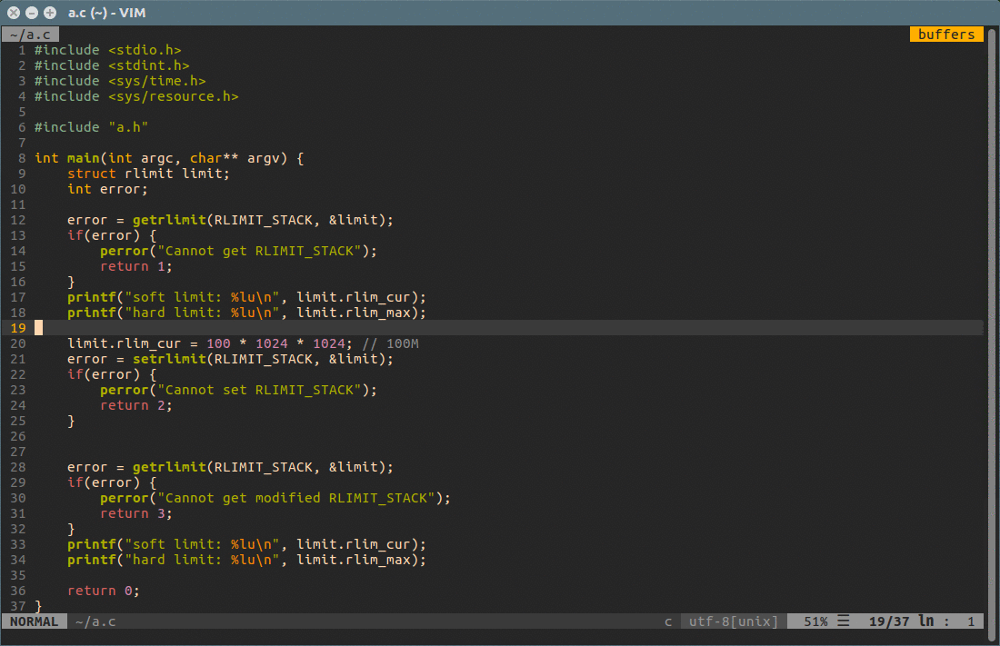

# vim-parsenumber


**vim-parsenumber** converts the numbers under the current cursor to various units.

## Prerequisite

* vim with python support

## Installation

it's recommended that you use a plugin manager like [vim-plug](https://github.com/junegunn/vim-plug)

### vim-plug

```
Plug 'makerj/vim-parsenumber'
```

### Vundle

```
Plugin 'makerj/vim-parsenumber'
```

## Usage

### Normal Mode

Parse under the curernt cursor

```
:ParseNUmber
```

